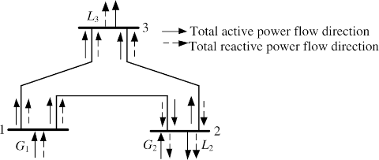

# Introduction

The method presented in the code enable accurate calculation of power
flow contributions, both active and reactive, from any power source to
any network element and load. Additionally, it facilitates the
determination of losses in network elements associated with these
contributions. Consequently, the method provides the capability to
calculate network power losses associated to every source-to-load pair,
as well as power losses in the network attributed to any specific load
or any source.

[Go to full paper](https://www.sciencedirect.com/science/article/abs/pii/S0378779624003213)

# Install

In the code we perform power flow computation using
[Matpower](https://github.com/MATPOWER/matpower), which we also use as a source
of input data for several test cases. We run Matpower under [GNU Octave](https://octave.org),
therefore both GNU Octave and Matpower have to be installed. To test the
functionality, open up a terminal or a command prompt, navigate to the directory
with the code and run the following command

`octave --eval "my_runpf('case1')"`

Python requirements are installed with the following command

`pip install -r requirements.txt`

# Run

The file [`case1.m`](case1.m) contains the input data, in Matpower format, for the simple
power system depicted in Fig. 1. In order to calculate the power flow
contributions run the following command

`python power_components.py -c case1`

The components of active power losses (kW) in each branch can be obtained with
the following command, which generates table 4

`python losses_components.py -c case1`

|                   |
| :----------------------------------------------: |
| Fig. 1. Single-line diagram of the simple system |

In this system, each line is represented by a π-equivalent circuit with
total series impedance (12+j40.9) Ω and a total shunt admittance of
j277 μS. The generator at bus 2 produces 20 MW of active power and
consumes 5 Mvar of reactive power. Loads at bus 2 and 3 are equal and
their power consumption is (50 + j20) MVA. Total line losses in the
network amount to (4.727+j6.743) MVA and the total generator power at
bus 1 is (84.727+j51.743) MVA.

Table 1 presents the results of total active and reactive power flows at
both line buses.

The reason we selected this simple system is to demonstrate, within a
reasonably small space, all the results that can be obtained using the
proposed method. These results are presented in Tables 2-5.

Table 1. Total Power Flows in Lines (MVA)

| Line  |    Beginning     |       End        |
| :---: | :--------------: | :--------------: |
|  1-2  | 38.608 + j26.148 | 36.545 + j22.378 |
|  1-3  | 46.119 + j25.595 | 43.506 + j19.945 |
|  2-3  |  6.545 - j2.622  |  6.494 + j0.055  |

Table 2. Origin of Active and Reactive Power Flow Contributions in Loads (MVA)

|   Load    |   Generator 1    | Generator 2 | Line 1-2 | Line 1-3 | Line 2-3 |
| :-------: | :--------------: | :---------: | :------: | :------: | :------: |
| Load at 2 | 32.315 + j15.662 |   17.685    |  j2.241  |          |  j2.098  |
| Load at 3 | 47.703 + j17.286 |    2.297    |          |  j2.659  |  j0.055  |
| Gen. at 2 |     j3.9154      |     20      | j0.5602  |          | j0.5244  |

Table 3. Origin of Active and Reactive Power Flow Contributions in Lines (MVA)

| Line and bus |   Generator 1    | Generator 2 | Line 1-2 | Line 1-3 | Line 2-3 |
| :----------: | :--------------: | :---------: | :------: | :------: | :------: |
|   1-2 at 1   | 38.608 + j26.148 |             |          |          |          |
|   1-2 at 2   | 36.545 + j19.577 |             |  j2.801  |          |          |
|   1-3 at 1   | 46.119 + j25.595 |             |          |          |          |
|   1-3 at 3   | 43.506 + j17.286 |             |          |  j2.659  |          |
|   2-3 at 2   |       4.23       |    2.315    |          |          |  j2.622  |
|   2-3 at 3   |      4.197       |    2.297    |          |          |  j0.055  |

Table 4. Participation of Sources in Line Power Losses (MVA)

| Line  |     Gen. 1     | Gen. 2 | Line 1-2 | Line 1-3 | Line 2-3 |     Total      |
| :---: | :------------: | :----: | :------: | :------: | :------: | :------------: |
|  1-2  | 2.063 + j6.571 |        | -j2.801  |          |          | 2.063 + j3.770 |
|  1-3  | 2.613 + j8.309 |        |          | -j2.659  |          | 2.613 + j5.650 |
|  2-3  |     0.033      | 0.018  |          |          | -j2.677  | 0.051 - j2.677 |

Table 5. Source to Load Pairs Power Losses (MVA)

|   Source to load pair   |    Line 1-2    |    Line 1-3    |    Line 2-3    |
| :---------------------: | :------------: | :------------: | :------------: |
|    Gen. 1 to load 2     | 1.824 + j5.257 |                |                |
|    Gen. 1 to load 3     |     0.239      | 2.613 + j8.309 |     0.033      |
|  Gen. 1 to generator 2  |     j1.314     |                |                |
|    Gen. 2 to load 3     |                |                |     0.018      |
|   Line 1-2 to load 2    |    -j2.241     |                |                |
| Line 1-2 to generator 2 |    -j0.560     |                |                |
|   Line 1-3 to load 3    |                |    -j2.659     |                |
|   Line 2-3 to load 2    |                |                |    -j2.0973    |
|   Line 2-3 to load 3    |                |                |    -j0.0550    |
| Line 2-3 to generator 2 |                |                |    -j0.5243    |
| Total line power losses | 2.063 + j3.770 | 2.613 + j5.650 | 0.051 - j2.677 |

# Results
All results are given in [results](results). For the `case1` the active power
flow components are given in the file [case1-apfc.csv](results/case1-apfc.csv),
while the reactive power flow components are in
    [case1-rpfc.csv](results/case1-rpfc.csv). In the file
    [case1.log](results/case1.log) the details of the calculations are
    given. Similar naming scheme is used for all other cases.
